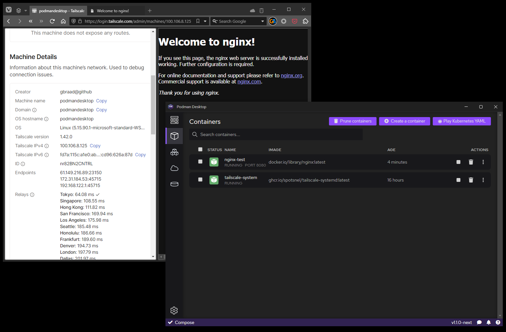

Tailscale extension for Podman Desktop
======================================

Tailscale extension for Podman Desktop that lets you securely connect to your containers without exposing them to the public internet

Currently only performs basic activation and authentication

### Dependencies

  - [Podman Desktop](https://podmanesktop.io)
  - [Tailscale](https://tailscale.com)
  - [Tailscale system image](https://github.com/spotsnel/tailscale-systemd)
